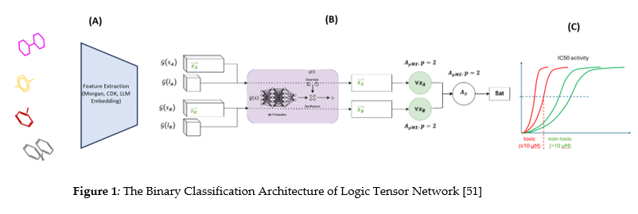
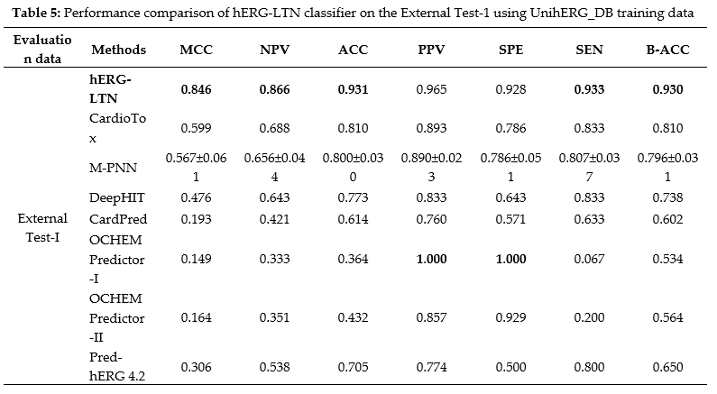
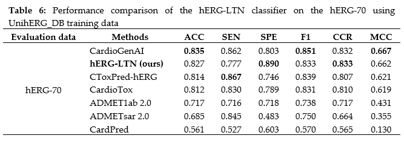

# hERG-LTN: A New Paradigm in hERG Cardiotoxicity Assessment Using Neuro-Symbolic and Generative AI Embedding (MegaMolBART, Llama3.2, Gemini, DeepSeek) Approach

---

## Abstract
Assessing adverse drug reactions (ADRs) during drug development is essential for ensuring the safety of new compounds. The blockade of the Ether-a-go-go-related gene (hERG) channel plays a critical role in cardiac repolarization. Computational predictions of hERG inhibition can help foresee drug safety, but current data-driven approaches have limitations. Therefore, a new paradigm that bridges the gap between data and knowledge offers an alternative for advancing precision pharmacogenomics in assessing hERG cardiotoxicity.

This study aims to develop a reasoning-based, *in silico*, robust model for predicting drug-induced hERG inhibition, thereby facilitating new drug development by reducing time and cost, supporting downstream *in vitro* and *in vivo* testing. 

In this study, we constructed a new cohort, **UnihERG_DB**, by sourcing data from ChEMBL, PubChem, BindingDB, GTP, hERG Karim's, and hERG Blocker's bioactivity databases. The final dataset comprises **20,409 structures** represented as SMILES (Simplified Molecular Input Line Entry System), labeled as hERG blockers (**IC50 < 10 µM**) or non-hERG blockers (**IC50 ≥ 10 µM**). Molecular features were extracted using **Morgan** and **CDK fingerprints**. Furthermore, we explored embedding feature computation using cutting-edge Large Language Models, including **NVIDIA MegaMolBart**, **LLaMA 3.2**, **Gemini**, and **DeepSeek**. 

Finally, we utilized the **Logic Tensor Network (LTN)**, an advanced AI framework, to train and develop the hERG predictive model. Model performance was evaluated using two benchmarks: **External Test-1** and **hERG-70**. The Logic Tensor Network (LTN) outperformed several models, including **CardioTox**, **M-PNN**, **DeepHIT**, **CardPred**, **OCHEM Predictor-II**, **Pred-hERG 4.2**, **Random Forest**, and **Gradient Boosting**. 

- On the **External Test-1** dataset, LTN achieved an **accuracy of 0.931**, a **specificity of 0.928**, and a **sensitivity of 0.933**.  
- On the **hERG-70** benchmark, LTN achieved an **accuracy (ACC) of 0.827**, a **specificity (SPE) of 0.890**, and a **correct classification rate (CCR) of 0.833**.

Overall, the Neuro-Symbolic AI approach sets a new standard for hERG-related cardiotoxicity assessment, yielding competitive results with current state-of-the-art (SOTA) models, and highlights its potential for advancing precision pharmacogenomics in drug discovery and development.
### Dataset
data card: [Download](https://drive.google.com/drive/folders/1joG-nNPFJ12TAsu2nesSI6ctimB8hU_7?usp=sharing)

### Architecture

### Result
* **Externel Positive Testset-I**

* **Externel hERG-70 Testset-II**
